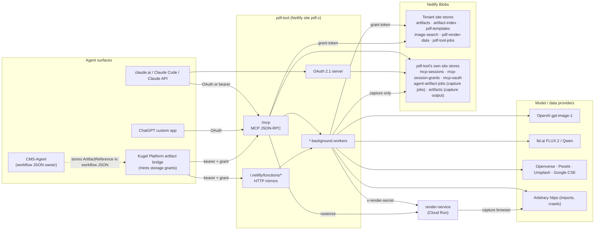
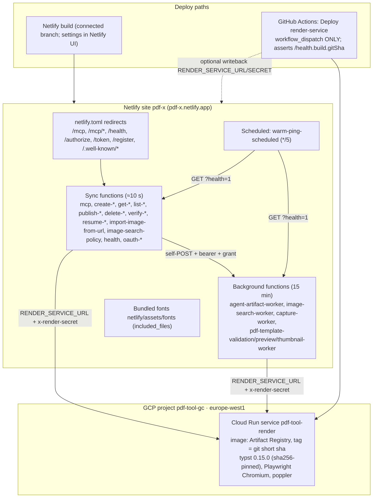
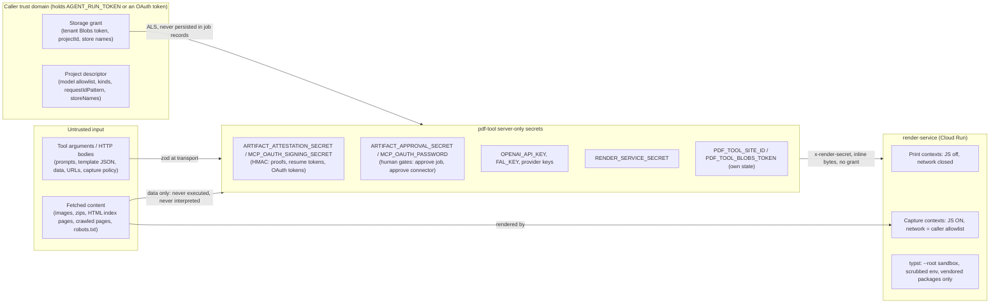

# pdf-tool architecture

> Source-verified at commit `60bdb98762e5c10849958dbd65beba73a0d1bb31` (2026-09-06 architecture audit). Every claim below cites the file/symbol it was read from. When code and this document disagree, the code is right and this document has drifted — fix the document and say so in `KNOWN_ISSUES.md`.

pdf-tool is the **artifact foundry** of the Kugel agent-first publishing architecture: it turns agent intent (a prompt, a template + data, a URL, a site) into **binary artifacts** (images, PDFs, page rasters, capture snapshots) and writes them into **the caller's own Netlify Blob stores** under a short-lived storage grant. It exposes that capability as an MCP server (`POST /mcp`) and as plain HTTP functions. It does **not** own content, workflow JSON, publishing, or approval policy — those live in the Platform / CMS-Agent side.

## 1. Runtime components

| Component | Entrypoint | Hosting | Inbound | Outbound | Auth | Persistence | Failure boundary | Retry | Status |
|---|---|---|---|---|---|---|---|---|---|
| **MCP endpoint** | `netlify/functions/mcp.ts` (`handler`) | Netlify Function (sync, ~10 s budget) | `POST /mcp` JSON-RPC; `DELETE /mcp` (session end); `GET /mcp?health=1` | lib handlers → Blob stores (grant), background workers (self-POST), render-service (rasterize) | bearer `AGENT_RUN_TOKEN`, OAuth access token, or URL connector key (`isAuthorizedMcpRequest`) | pdf-tool-own: `mcp-sessions`, `mcp-session-grants`; tenant stores via grant | thrown tool errors become JSON-RPC results, never 5xx (`mcp.ts:851-855`) | none (client re-calls) | CURRENT |
| **HTTP mirror functions** | `netlify/functions/{create,get,...}-*.ts` | Netlify Functions (sync) | `POST`/`GET` per function | same lib handlers as MCP | bearer `AGENT_RUN_TOKEN` (`isAuthorized`) | via grant | per-function JSON errors | none | CURRENT (two LEGACY: `agent-artifact-job`, `agent-artifact-job-status`) |
| **OAuth 2.1 server** | `netlify/functions/oauth-*.ts` | Netlify Functions | `/.well-known/*`, `/register`, `/authorize`, `/token` | pdf-tool-own `mcp-oauth` store (best-effort) | owner password on consent; PKCE on token | `clients/*`, `used-codes/*` | degrades to stateless (PKCE-only single-use) when Blobs is down | none | CURRENT |
| **Artifact worker** | `netlify/functions/agent-artifact-worker-background.ts` | Netlify **Background** Function (15 min hard kill) | self-POST `{projectId, jobId, storage, descriptor}` | OpenAI / fal.ai (images), render-service (chromium/typst), in-process pdfme/react-pdf, tenant Blob stores | bearer `AGENT_RUN_TOKEN`; grant in body | job record + artifact + indexes (tenant stores) | job → `failed` with `errorCode`; `WORKER_TIMEOUT_APPROACHING` ~30 s before kill | none automatic; `get_agent_artifact_job_status` auto-fails `running` > 12 min | CURRENT |
| **Image-search worker** | `image-search-worker-background.ts` | Background Function | self-POST | Openverse/Pexels/Unsplash/Google, arbitrary https (imports), tenant stores | bearer + grant | job record, bank, artifacts | job → `failed` | none | CURRENT |
| **Capture worker** | `capture-worker-background.ts` | Background Function | self-POST | robots/sitemap/asset fetches, render-service `/capture/page`, **pdf-tool's own** stores | bearer; grant accepted but ignored | capture job (frontier) + artifacts in pdf-tool's own site | persists frontier and chain re-triggers itself near the budget | resume-from-frontier | CURRENT |
| **Template workers** | `pdf-template-{validation,preview,thumbnail}-worker-background.ts` | Background Functions | self-POST | render engines, tenant `templates` store | bearer + grant | validation report / preview PNGs / thumbnail PNG | report → `failed` | none | CURRENT |
| **Warm ping** | `warm-ping-scheduled.ts` | Netlify Scheduled Function `*/5 * * * *` | cron | `GET /mcp?health=1`, `GET agent-artifact-worker-background?health=1` | none | none | logs only | n/a | CURRENT |
| **render-service** | `render-service/src/index.ts` → `server.ts` (Fastify) | Cloud Run `pdf-tool-render` (project `pdf-tool-gc`, `europe-west1`, concurrency 2, 2 GiB) | `POST /render/{typst,chromium}`, `/rasterize/pdf`, `/capture/page`, `GET /health` | none except the capture browser's allowlisted origins | `x-render-secret` = `RENDER_SERVICE_SECRET` (fail-closed) | **none** (stateless; per-request temp dirs) | typed `{ok:false, code}`; 504 on timeout | none | CURRENT |
| **Template publisher CLI** | `scripts/publish-article-template.mjs` | operator laptop | argv | MCP endpoint | `PDF_TOOL_AGENT_RUN_TOKEN` + a grant built from `PDF_TOOL_STORAGE_*` | none | exits non-zero | manual | CURRENT (operator tooling) |

There is **no** database, queue, or cache other than Netlify Blobs. Background execution is "POST to self and return 202"; there is no retry queue and no dead-letter store.

## 2. System context

## 3. Deployment topology

Facts worth stating plainly (all from `.github/workflows/deploy-render-service.yml`, `render-service/deploy/cloud-run.sh`, `netlify.toml`):

- The Netlify side is built by Netlify from the connected branch; the site's build settings live in the Netlify UI, not in this repo (`netlify.toml` configures only the functions bundler, fonts, redirects and the warm-ping schedule). **No GitHub workflow runs `npm test`** — the only workflow is the manual render-service deploy. `CLAUDE.md` says `main` is protected without required checks; nothing in the repo can confirm branch protection.
- The render-service image is built by Cloud Build from a clean checkout and tagged with the short git sha; `/health` reports `build.gitSha` and the deploy script asserts it matches, because a 2026-08-19 redeploy from a stale laptop checkout silently shipped old code.
- `RENDER_SERVICE_SECRET` is reused from the running service on redeploy unless the `RENDER_SERVICE_SECRET` GitHub secret is set (rotation is explicit, never accidental).
- The Netlify side has **two ways to reach its own Blob stores**: the platform same-site context, and `PDF_TOOL_SITE_ID`/`PDF_TOOL_BLOBS_TOKEN` when set (`artifact-core/blob-store.ts:144-150`). The README used to say those variables were removed; they were reinstated after `initialize` failed in production with "The environment has not been configured to use Netlify Blobs" (`tests/agent-artifact-blob-credentials.test.ts:20-28`).

## 4. Planes

pdf-tool is four largely independent planes sharing one transport, one storage-grant mechanism and one artifact layout:

| Plane | Entry tools | Worker | Engine(s) | Writes to | Doc |
|---|---|---|---|---|---|
| **Artifact jobs** (image generate/edit, PDF render/edit) | `create_agent_artifact_job`, `get_agent_artifact_job_status`, `get_agent_artifact_by_{slot,filename}`, `verify_agent_artifact`, `resume_agent_artifact_job`, `inspect_pdf_artifact`, `rasterize_pdf_artifact` | `agent-artifact-worker-background` | OpenAI, fal.ai, pdfme, react-pdf (in-function); chromium, typst (render-service) | tenant `pdf-tool-jobs`, `artifacts`, `artifact-index`, `pdf-render-data` | `JOB_LIFECYCLE.md`, `PDF_RENDERING.md`, `ARTIFACT_CONTRACT.md` |
| **PDF templates** | `create/get/list/publish/delete_pdf_template`, `validate_pdf_template`, `get_pdf_template_validation`, `preview_pdf_template`, `derive_render_data_schema` | validation / preview / thumbnail workers | same renderers | tenant `pdf-templates` | `PDF_RENDERING.md` |
| **Image sourcing** | `search_images`, `get_image_search_{job_status,bank}`, `update_image_search_candidate`, `import_image(s)_from_url`, `get/set_image_search_policy`, `get/set_image_model_policy` | `image-search-worker-background` | stock providers, https fetch, sharp | tenant `image-search`, `artifacts`, `artifact-index`, `pdf-tool-jobs` | `IMAGE_PIPELINE.md` |
| **Site capture** | `create_capture_job`, `get_capture_job_status`, `get_capture_snapshot` | `capture-worker-background` (self-chaining) | render-service `/capture/page` (JS-enabled Chromium) | **pdf-tool's own** `agent-artifact-jobs`, `artifacts`, `artifact-index` | `CAPTURE_ARCHITECTURE.md` |

Cross-cutting: transport/session/OAuth state (`mcp-session.ts`, `mcp-session-grant.ts`, `mcp-oauth.ts`) is pdf-tool-owned and grant-free; everything tenant-facing runs inside `runWithRequestContext` (`project-descriptor.ts:378`), which puts the grant and descriptor into `AsyncLocalStorage` so every store opener (`artifact-core/blob-store.ts:projectBlobStore`) resolves credentials and store names from the request, never from the environment.

## 5. Trust boundaries

Boundary statements that another agent must not get wrong:

1. **Everyone holding `AGENT_RUN_TOKEN` is one trust domain.** There is no per-tenant credential on the pdf-tool side; tenant isolation comes from the storage grant (the tenant's own Blobs token names the store). A grant with no `projectId` is bound to nothing (`storage-grant.ts:242`), and the capture plane has no tenant isolation beyond key prefixes (`capture/storage.ts`, `SECURITY.md §3`).
2. **The grant token is "radioactive" only for job records.** It travels tool args → ALS → worker POST body, is never written into a job record (`ArtifactJobRequest` zod schema strips unknown keys), never logged (`redactGrant`) — but `set_storage_grant` does persist it, by design, TTL-capped (`mcp-session-grant.ts:6-25`; see `KNOWN_ISSUES.md` KI-01 for the store-routing defect).
3. **Attestations are forgery-resistant only with a dedicated secret.** With the default fallback to `AGENT_RUN_TOKEN`, any caller can mint a `materializationProof`; `verify_agent_artifact` then demands the storage-backed `persisted` check (`agent-artifact-verification.ts:139-152,186-198`).
4. **Approval is a secret, not an identity.** `resume_agent_artifact_job` checks that the caller knows `ARTIFACT_APPROVAL_SECRET`/`MCP_OAUTH_PASSWORD`; nothing records who approved.
5. **render-service trusts Netlify only.** It authenticates a shared secret, holds no storage credentials, and receives template/data/asset bytes inline; the storage grant never leaves Netlify (`render-service-client.ts:126-140`).
6. **Fetched content is data.** Nothing pdf-tool downloads (images, zips, crawled HTML, robots.txt) is executed or interpreted as instructions on the Netlify side; the capture browser does execute the crawled site's JavaScript, inside a per-page context routed to the caller's origin allowlist.

## 6. Where to read next

- Storage ownership and every blob key: `STORAGE_ARCHITECTURE.md`
- The seven artifact-reference representations: `ARTIFACT_CONTRACT.md`
- Job states, approval, verification: `JOB_LIFECYCLE.md`
- Generated tool / endpoint catalogues: `MCP_REFERENCE.md`, `HTTP_REFERENCE.md`
- Defects and risks found by the audit: `KNOWN_ISSUES.md`
- Compact orientation for a coding agent: `AI_CONTEXT.md`
