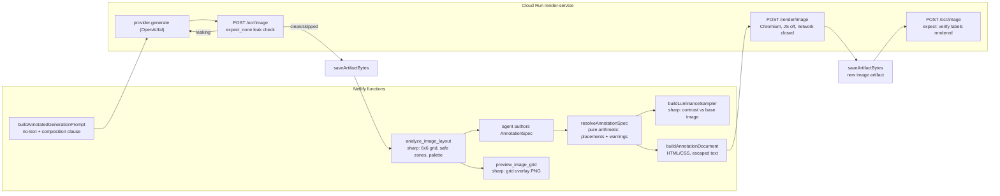

# Image pipeline: generation, editing, sourcing, import

> Source-verified at commit `60bdb98762e5c10849958dbd65beba73a0d1bb31`. Sourcing policy reference (JSON fields, scoring formula): `docs/IMAGE_SEARCH.md` (its "Roadmap" section is historical).

Three distinct planes share the tenant `artifacts`/`artifact-index` stores and the canonical layout:

- **Generated / edited images** — `create_agent_artifact_job{artifactKind: "image"}` → `agent-artifact-worker-background` → OpenAI or fal.ai (or sharp for deterministic edits).
- **Annotated images** (`image.annotate`) — deterministic text/arrow/badge/box/scrim/logo overlays drawn over an *already-stored* image. Entirely tenant plane, entirely synchronous (no job record). See §2.
- **Sourced / imported images** — `search_images`, `import_image_from_url`, `import_images_from_url` → `image-search-worker-background` (or synchronous for the single import) → stock providers / arbitrary https → the per-request **candidate bank** (`banks/{requestId}.json` in the tenant `image-search` store).

## 1. Generation and editing

```mermaid
flowchart LR
  C[create_agent_artifact_job image] --> R{model?}
  R -- explicit --> CAN[canonicalImageModel<br/>flux-2 → fal-ai/flux-2/klein/9b]
  R -- omitted --> POL[image-model-policy.json by usageContext<br/>article_header/body/category_page → fal-ai/flux-2/klein/9b<br/>else descriptor.defaultModel → gpt-image-1]
  CAN --> V[validate: descriptor.allowedModels ∪ DEFAULT_ALLOWED_MODELS ∪ env additions]
  POL --> V
  V --> B[chargeGenerationBudget<br/>USD/megapixel from pricing.ts]
  B --> W[worker: executeAgentArtifactWorkflow]
  W --> SDK["@openai/agents Runner (gpt-4.1)<br/>calls tool generate_image_artifact"]
  SDK --> P{operation}
  P -- generate --> G[provider.generate<br/>openai images.generate | fal queue submit+poll]
  P -- edit deterministic_transform --> S[sharp transform, no model]
  P -- edit masked_edit / image_variation --> E[provider.edit — capability-checked,<br/>IMAGE_EDIT_MODE_UNSUPPORTED otherwise]
  G --> O[optimizeImageBytes → ≤ maxBytes (warn, not block)]
  S --> O
  E --> O
  O --> SAVE[saveArtifactBytes + by-slot/by-filename]
```

| Fact | Where |
|---|---|
| Providers: `openai` (`gpt-image-1`) and `fal` (`fal-ai/flux-2/klein/4b|9b`, `flux-2-pro`, `flux-2-flex`, `qwen-image`, `qwen-image-edit`); aliases `flux-2`, `qwen-image`, `qwen-image-edit` | `image-providers/registry.ts`, `openai.ts`, `fal.ts` |
| Default allowlist includes two test models (`test-image-model`, `alternate-test-image-model`) — tighten with `descriptor.allowedModels` | `project-descriptor.ts:51-60` |
| Size allowlist `1024x1024`, `1024x1792`, `1792x1024`, `1536x1024`, `1024x1536`; output formats png/webp/jpeg; `maxBytes` default 5 000 000 with **warn-not-block** after best-effort optimization | `agent-artifact-jobs.ts`, `agent-image-generation.ts` |
| Cost: static USD-per-megapixel table (`IMAGE_PRICE_TABLE_VERSION = fal-list-prices-2026-07-20`); OpenAI is "unpriced" and counted against `GENERATION_UNPRICED_LIMIT_PER_REQUEST` (25); paid spend capped by `GENERATION_BUDGET_USD_PER_REQUEST` (5; `0` disables) — ledger is a non-atomic read-modify-write that **fails open** on storage errors | `image-providers/pricing.ts`, `generation-budget.ts` |
| 429 etiquette: no blind retries; at most one wait honoring `Retry-After` within the worker budget | `worker-budget.ts:withRateLimitEtiquette` |
| Edit jobs lock the source by `sourceArtifact.expectedSha256` (re-hashed on read); masks via `maskRef`; provenance recorded in `metadata.derivedFrom` | `agent-image-editing.ts:readSourceArtifactBytes`, worker `:170-181` |
| **The Agents SDK wrapper:** `executeAgentArtifactWorkflow` builds an `@openai/agents` `Agent` with one tool and runs it through `Runner.run` (SDK default model `gpt-4.1`, `OPENAI_API_KEY` from env) with the instruction to call the tool exactly once; if the run ends without bytes, the tool handler is called directly. Tests stub the SDK (`AGENT_ARTIFACT_TEST_AGENT_SDK=1`), so the production loop is untested; see `KNOWN_ISSUES.md` KI-28 | `agent-artifact-workflow.ts:50-56,73-87,172-177` |
| Fixed-image test seam: `AGENT_ARTIFACT_TEST_IMAGE_B64` (only with `NODE_ENV=test`) | `agent-image-generation.ts:245` |

Provenance metadata on generated artifacts: `imageRole`, `usageContext`, and for edits `operation: "edit"`, `derivedFrom: {blobKey, sha256}`, `editMode`, `editSummary`, `preserved[]`. No license field is written for generated images: **rights in generated output are governed by the provider's terms, and pdf-tool records only which provider/model produced it (`selectedModel`, `costReceipt`).**

## 2. Annotation (`image.annotate`)

Deterministic overlay of text, arrows, badges, boxes, scrims and logos onto an image that is **already a stored artifact** — never the generative model. The whole point is the split: a model draws pixels, this pipeline draws *labels*, and the two never mix inside one render call.

**Three stages, three tools, three places code runs:**

1. **Generate with the no-text guard.** A `create_agent_artifact_job{artifactKind:"image"}` generate job that opts in with `requirements.image.annotate: true` gets `job.prompt` rewritten by `buildAnnotatedGenerationPrompt` (`agent-image-generation.ts`) — a hard instruction not to render any text/labels/arrows/logos, plus a composition hint to leave negative space. After the model returns bytes, `checkImageTextLeak` (the OCR gate, `expect_none` mode) runs once; if it flags leaked text, the workflow spends one automatic regenerate (charged like any other generation) and keeps whichever attempt comes back, with a warning either way. This step runs **in the Netlify worker** (prompt rewrite) plus **Cloud Run** (the OCR call).
2. **Analyze.** `analyze_image_layout` hands back `LayoutHints` — a 6×6 grid, ranked safe zones, a dominant palette — so an agent can pick *named* positions ("place the caption in B5") instead of guessing pixels. `preview_image_grid` renders that grid as a visible PNG artifact for a human/agent to eyeball. Both are pure **sharp arithmetic inside the Netlify function** — no browser, no model, no randomness.
3. **Annotate deterministically.** The agent authors an `AnnotationSpec` (§2.3) naming the same base artifact `analyze_image_layout` looked at. `annotate_image` resolves it (`resolveAnnotationSpec`, pure arithmetic, Netlify-side), assembles an HTML/CSS document (`render.ts`), and sends it to the render service's `POST /render/image`, which screenshots it with a warm, JS-disabled, network-locked Chromium — **Cloud Run**, not Netlify (there is no Playwright in a Netlify function). `check_image_text{mode:"expect"}` can then OCR the finished PNG to confirm the labels the spec asked for actually rendered.



### 2.1 The four tools

| Tool (wire name) | Prose operation | Sync? | Writes | Runs where |
|---|---|---|---|---|
| `annotate_image` | `image.annotate` | synchronous, pre-flight-budgeted like `rasterize_pdf_artifact` (refuses up front with `ANNOTATE_BUDGET_EXCEEDED` rather than being killed mid-render) | a new `image` artifact (the annotated PNG/JPEG/WebP) + `render_report` | resolve/assemble in Netlify; the Chromium screenshot in Cloud Run (`POST /render/image`) |
| `analyze_image_layout` | — (no BRIEF prose op; pure query) | synchronous, no budget refusal (bounded by the fixed 384×384 working buffer, not source size) | nothing | Netlify only (sharp) |
| `preview_image_grid` | — | synchronous | a new `image` artifact (the grid-overlay PNG) | Netlify only (sharp) |
| `check_image_text` | `image.text_check` | synchronous, pre-flight-budgeted (`OCR_BUDGET_EXCEEDED`) | nothing | resolve/match in Netlify; OCR in Cloud Run (`POST /ocr/image`, tesseract) |

All four share one access path: `resolveSourceImage` (`agent-artifact-image-annotate.ts`) — the same `verifyArtifactMaterialization` scoping every other artifact tool uses (`projectId`/`requestId` + `artifactReference` or `blobKey`/`sha256`, optional `materializationProof`), plus a bytes-level check that the stored artifact really is a PNG/JPEG/WebP/GIF. **The operation router is not involved**: `annotate_image`/`analyze_image_layout`/`preview_image_grid`/`check_image_text` create no job record, so `resolveOperationRoute`'s `artifactKind`/`operation` enum gained no new member for annotation — a design note worth flagging because an earlier planning pass (BRIEF.md §3.5) expected a new `operation:"annotate"` job route; the shipped code deliberately routes around the job system entirely instead, on the same reasoning `rasterize_pdf_artifact` already established (one deterministic render fits a synchronous call, not a background job).

A `logo` element's `artifactRef` is access-checked exactly like the base image (same `resolveSourceImage` call, same `projectId`/`requestId`) — see `docs/KNOWN_ISSUES.md` KI-31 for the scoping gap this creates.

### 2.2 Caps and refusal order

Every cap below is a NAMED refusal. The element/avoid-zone counts and the canvas size are checked BEFORE `annotate_image`'s pre-flight budget estimate runs, so an over-cap request returns the same error code regardless of how much of the caller's remaining clock is left — before this ordering was fixed, an oversized canvas could come back as `ANNOTATE_BUDGET_EXCEEDED` (a budget problem, not a caps problem) or, with no budget in scope at all (`budgetMs: 0`), not be refused locally until the render service itself rejected it. A caller-fixable input must not depend on timing to get the right code.

| Cap | Value | Enforced by | Code | Checked relative to the budget estimate |
|---|---|---|---|---|
| Elements per spec | 256 (`MAX_ANNOTATION_ELEMENTS`) | `spec.ts`'s zod schema | `TEMPLATE_INVALID` | before — the spec is parsed first, before anything else in `annotate_image` |
| Avoid zones per spec | 64 (`MAX_AVOID_ZONES`) | `spec.ts`'s zod schema | `TEMPLATE_INVALID` | before |
| Canvas edge / megapixels | 4096px per side; 16.78 megapixels at the requested `deviceScaleFactor` | `assertImageCanvasWithinCaps` (`pdf-render/image-render-client.ts`), called explicitly in `annotateImageArtifact` before the budget estimate is computed | `IMAGE_CANVAS_TOO_LARGE` | before, by an explicit dedicated assertion the function's own comment calls out for exactly this reason |
| Bytes per asset (base image or one logo) | 5 MB (`MAX_IMAGE_ASSET_BYTES`) | checked per logo while resolving logo bytes (`agent-artifact-image-annotate.ts`), and re-asserted authoritatively — covering the base image too — inside `renderAnnotation` via `assertImageAssetsWithinCaps` (`render.ts`) | `ASSET_TOO_LARGE` | after the budget estimate in source order, but UNCONDITIONAL — never gated on `budgetMs`, so it still returns the same code independent of remaining clock |
| Bytes total (base image + every logo) | 20 MB (`MAX_IMAGE_ASSETS_TOTAL_BYTES`) | same two call sites as above | `ASSET_TOO_LARGE` | same as above |

`analyze_image_layout`/`preview_image_grid` carry no analogous element/canvas caps (there is no `AnnotationSpec` to bound) — they are bounded only by `analyze.ts`'s own fixed 384×384 working buffer, independent of the source image's own size.

### 2.3 AnnotationSpec v1 (`netlify/lib/image-annotate/spec.ts`)

```jsonc
{
  "version": 1,
  "canvas": { "w": 1024, "h": 1024 },
  "base": { "artifactRef": { "blobKey": "…", "sha256": "…" } },
  "theme": { "fontFamily": "…", "textColor": "#111", "textColors": { "title": "#fff" }, "accentColor": "#e5484d", "scrimColor": "#000" },
  "elements": [
    { "type": "text", "id": "t1", "content": "…", "at": "B5", "anchor": "tl", "maxWidth": 0.9, "style": "label", "align": "left" },
    { "type": "arrow", "id": "a1", "from": "A1", "to": "#t1", "curve": 0, "style": "thin" },
    { "type": "badge", "id": "b1", "n": 1, "at": { "x": 0.1, "y": 0.1 } },
    { "type": "box", "id": "x1", "rect": { "at": "A1", "w": 0.2, "h": 0.1 }, "style": { "fill": "#fff" } },
    { "type": "scrim", "id": "s1", "rect": { "at": "A5", "w": 1, "h": 0.3 }, "direction": "bottom", "strength": 0.6 },
    { "type": "logo", "id": "l1", "at": "F1", "size": 0.08, "artifactRef": { "blobKey": "…", "sha256": "…" } }
  ],
  "avoid": [ { "at": "C3", "w": 0.2, "h": 0.2 } ]
}
```

- **Positions** are either a 6×6 grid cell (`"A1"`..`"F6"`, columns A–F left→right, rows 1–6 top→bottom — the same ids `analyze_image_layout` reports) or a normalized `{x, y}` point (0–1 fractions of the canvas, never pixels).
- **`avoid[]`** is geometry only — `{at, w, h}` rects that text/badge elements get pushed out of. There is no keyword form (no `"faces"`, no semantic tag); see KI-32.
- Every element carries a unique `id`; an arrow endpoint written as `"#id"` resolves to that element's box edge at render time.
- The schema is `.strict()` end to end — an unknown field is rejected with `TEMPLATE_INVALID` and the offending path, never silently dropped.

### 2.4 LayoutHints (`analyze_image_layout` → `netlify/lib/image-annotate/analyze.ts`)

```jsonc
{
  "image": { "w": 2048, "h": 1536 },
  "grid": { "cols": 6, "rows": 6, "cells": [ { "id": "A1", "lum": 0.0..1, "busy": 0.0..1, "color": "#rrggbb" }, /* 36 total */ ] },
  "safeZones": [ { "rect": { "x": 0, "y": 0, "w": 0, "h": 0 }, "score": 0.0..1 }, /* up to 5, best first */ ],
  "faces": [],       // Phase 2, not implemented — always empty
  "subject": null,   // Phase 2, not implemented — always null
  "dominant": ["#rrggbb", /* up to 5 */]
}
```

Computed once from a 384×384 stretched working buffer (`WORKING_SIZE`), by Sobel edge density (`busy`) and mean luminance (`lum`) per cell; `safeZones` scores every contiguous rectangle of cells by `area * (1 - busy) * contrastHeadroom(lum)`, greedily de-duplicated by IoU. Deterministic for a **pinned sharp/libvips build** — same caveat as the PNG golden (BRIEF §3 finding 3, `docs/KNOWN_ISSUES.md` KI-36): the `fit:"fill"` resize and the Sobel pass both run through libvips, whose resize kernel can change across sharp/libvips releases, so "the same bytes always produce the same `LayoutHints`" holds run-to-run on one pinned dependency version, not as an absolute guarantee across an npm upgrade.

### 2.5 Warn-only report vocabulary (`render_report.warnings[]`)

Same discipline as every other quality gate in this repo (BRIEF §1): these never fail the call. `annotate_image` always returns `ok:true` with a populated `render_report` on a successful render; a caller decides whether a warning matters for its use case.

| Code | Raised by | Means | What a caller should do |
|---|---|---|---|
| `TEXT_SHRUNK` | resolver (Netlify) | the font size was reduced below the style's base size to make the string fit `maxWidth` | cosmetic unless `detail.to` is near `MIN_FONT_PX` (10px) — then shorten the text or widen `maxWidth` |
| `TEXT_WRAPPED` | resolver | the string broke across multiple lines | usually fine; check `detail.lines` isn't unexpectedly high for a short label |
| `TEXT_OVERFLOW` | resolver | the string still didn't fit at the minimum font size — best-effort placement, not clipped | shorten the text, widen `maxWidth`, or accept the extra lines (they render below the box, never cut off) |
| `COLLISION_PUSHED` | resolver | two movable elements (text/badge) overlapped and were pushed apart | re-check the final layout looks right — the automatic push is a heuristic, not a design decision |
| `AVOID_ZONE_OVERLAP` | resolver | an element was pushed out of a declared `avoid[]` zone | confirm the pushed-out position is still acceptable |
| `CLAMPED_TO_CANVAS` | resolver | an element would have left the canvas and was moved back inside | check the element didn't end up somewhere nonsensical (e.g. a large box now overlapping something else) |
| `CONTRAST_LOW` | resolver, via `buildLuminanceSampler` | this element's own text color fails the WCAG 2.1 threshold (default 4.5:1) against the base image; an auto-scrim was inserted behind it | the auto-scrim usually fixes legibility, but it samples the **base image only**, not a spec-authored scrim/box already painted there (see `docs/KNOWN_ISSUES.md` KI-33) — visually confirm, don't trust the absence of this warning either |
| `ARROW_TARGET_NO_BOX` | resolver | an arrow's `"#id"` endpoint named an element with no box (e.g. another arrow) | fix the reference; the arrow fell back to canvas center |
| `MEASURED_BOX_DRIFT` | renderer, after the real Chromium render | the element's **rendered** box differs materially from the box **predicted** offline. `detail.measurementSource` says which prediction path produced the (wrong) predicted box: `"metrics"` — the bundled face's real glyph advances (`netlify/lib/image-annotate/font-metrics-data.ts`) were used and STILL drifted (see KI-30 for the one known such case, Hebrew shaping/kerning); `"heuristic"` — the average-advance estimate (`ADVANCE_RATIO`, ~0.52em/char) was used because the family/text wasn't one of the six bundled Noto faces (an uploaded font, an unrecognized family, or a codepoint the bundled face doesn't cover) | if the drift is on the height axis, the element likely now overlaps whatever is below it — re-check the render visually; there is no automatic re-layout. `measurementSource: "heuristic"` is the expected/common case for a non-bundled font; `"metrics"` drifting is worth a closer look |
| `MEASUREMENT_UNAVAILABLE` | renderer | the measurement pass did not run or returned nothing for this element, so the *absence* of `MEASURED_BOX_DRIFT` proves nothing | never infer "the layout was correct" from a run that also carries this warning |

As of KI-30's fix, `TextPlacement`/`BadgePlacement` themselves also carry `measurementSource` (`"metrics" | "heuristic" | undefined` — `undefined` only when a caller injected its own `measureText`, whose provenance resolve.ts cannot know) — observable even when the prediction turned out right and no `MEASURED_BOX_DRIFT` fired at all, not just inside a drift warning's `detail`.

`render_report.engineWarnings[]` (a separate free-text array, not part of the typed vocabulary above) carries render-service diagnostics — blocked assets, images that didn't finish decoding before capture, a logo skipped for missing bytes — each prefixed `annotate-renderer:` when this module (rather than the render service itself) produced the note.

## 3. Sourcing (`search_images`)

```mermaid
sequenceDiagram
  participant A as Agent
  participant M as search_images
  participant W as image-search-worker-background
  participant L as library (tenant by-tag index)
  participant T1 as tier 1: openverse · pexels · unsplash
  participant T2 as tier 2: google-cse
  participant B as bank banks/{requestId}.json
  A->>M: {projectId, requestId, query, …, storage}
  M->>W: job record (pdf-tool-jobs) + trigger
  W->>B: read bank; capacity = maxCandidatesPerRequest(5) − live search candidates
  W->>L: tier 0 always: list by-tag/<query token>/ → stored references
  alt qualified pool < candidateTarget (3)
    W->>T1: query providers enabled in policy (same tier, policy order)
    alt still below target
      W->>T2: google-cse (needs GOOGLE_CSE_KEY + CX; license class unknown)
    end
  end
  W->>W: score = weights·(cost 0.35, relevance 0.30, quality 0.20, license 0.15); drop < minScore 0.35; license classes ∉ allowClasses or unknown → excluded
  W->>W: download winners (https, ≤ maxImportBytes 5 MB ×4 raw), normalize (sharp), optimize ≤ 5 MB / 2048 px
  W->>B: saveArtifactBytes + candidate {provider, license, attribution, sourceUrl, score, state: kept}
  A->>M: get_image_search_bank → pick `selected`, `discard` the rest (deleteArtifact optional for url_import)
```

Provider order is **by cost tier**, not a fixed list: `library` is tier 0 and always queried; Openverse, Pexels and Unsplash are all tier 1 and are queried in the order they appear in `policy.providers`; Google CSE is tier 2 (`providers.ts:costTier`, `orchestrator.ts:114-140`). Providers without credentials are skipped, never fail. Hard cap: five non-discarded search candidates per request (`HARD_MAX_CANDIDATES_PER_REQUEST`); manual imports are bounded separately (`maxUrlImportsPerBatch` 20, `maxUrlImportsPerRequest` 50).

Licensing metadata (`ImageLicenseInfo {class, name, url, attribution, commercialUse}`) is recorded per candidate from the provider's declared license: Openverse maps CC codes (`cc0`/`pdm` → `public-domain`, `cc-*` → `permissive` with the declared commercial flag); Pexels and Unsplash are recorded as `permissive` with attribution; Google CSE results are `unknown` (`cc-rights-filtered-unverified` when rights-filtered) and are **excluded by the default policy** (`unknownLicense: "exclude"`, `requireCommercialUse: true`); library reuse inherits the stored license or `project-library`. **pdf-tool records what the provider claimed; it does not verify it.**

## 4. Direct imports

| Tool | Runs | Accepts | Guard | Produces |
|---|---|---|---|---|
| `import_image_from_url` | synchronously inside the function budget | one https URL to an image (gif/tiff/avif/… converted by sharp) | `assertSafeImportUrl`: https only, no `localhost`/`.local`/`.internal`, no IP literals — **redirects are followed by `fetch` without re-checking the target** (`import.ts:45-65`; contrast `capture/service-client.ts:fetchAssetBytes`) | artifact + `url_import` candidate; caller-asserted `license` (default unknown); with `slot` set the `by-slot` pointer is **replaced** (autonomy `additive+pointer`) |
| `import_images_from_url` | background job | a list of https URLs: image, **zip** (expanded in memory with `fflate.unzipSync` before per-entry size checks), or **HTML index page** (same-host ``/`<a href>` image links) | same URL guard per fetched URL; caps `maxUrlImportsPerBatch`/`PerRequest` | artifacts + candidates, per-source diagnostics |

**Rights clearance for direct imports is the caller's responsibility** (the tool records `license` as asserted, defaulting to unknown). Imported artifacts are ordinary image artifacts and can be edited via `create_agent_artifact_job{operation: "edit"}`.

## 5. Storage and state

| Record | Store · key | Notes |
|---|---|---|
| Candidate bank | tenant `image-search` · `banks/{requestId}.json` | candidates carry `state` (`kept`/`selected`/`discarded`), provider, license, `artifactReference`; `update_image_search_candidate` mutates in place; `deleteArtifact: true` removes bytes + sidecar of a discarded `url_import` candidate but leaves index pointers |
| Sourcing policy | `policy.json` | full overwrite by `set_image_search_policy`; defaults in `image-search/policy.ts:DEFAULT_IMAGE_SOURCING_POLICY` |
| Model policy | `image-model-policy.json` | `set_image_model_policy`; unknown contexts rejected (`IMAGE_USAGE_CONTEXTS`) |
| Search / import jobs | tenant `pdf-tool-jobs` · `projects/{projectId}/image-search-jobs/{jobId}.json` | no approval gate; no 12-minute auto-fail on poll |

## 6. Responsibility split

| Concern | pdf-tool | Caller (Platform / CMS-Agent / agent) |
|---|---|---|
| Choosing a model | routes by policy when omitted; validates against the allowlist | sets `model`/`usageContext`; maintains the policy |
| Spend | per-request USD ledger (best-effort) | overall budget; editorial/publishing approval |
| Rights | records provider-declared license and caller-asserted license; excludes unknown by default | verifies rights before publishing; owns attribution display |
| Style / brand | stores `style` verbatim, echoes `styleSource` | resolves visual standards into prompts/pixels |
| Selection | banks up to 5 candidates | picks `selected`, discards the rest |
| Annotation layout | resolves the spec deterministically, warns (never blocks) on fit/contrast/collision problems | authors the `AnnotationSpec`; decides whether a warning needs a re-author |
