# Job lifecycle, the execution-approval gate, and artifact verification

> Source-verified at commit `60bdb98762e5c10849958dbd65beba73a0d1bb31`. Covers the artifact-job plane (`create_agent_artifact_job` → worker). Image-search and capture jobs reuse the same job-record store and worker-trigger pattern; their differences are called out at the end.

## 1. States

`ArtifactJobStatus = "pending" | "running" | "complete" | "failed" | "blocked"` (`netlify/lib/agent-artifact-jobs.ts:722`). `complete` and `failed` are terminal. There is no `cancelled` and no cancel tool.

```mermaid
stateDiagram-v2
  [*] --> blocked: create with approval required<br/>(requireApproval or AGENT_ARTIFACT_APPROVAL_REQUIRED)
  [*] --> pending: create (job record written, worker POSTed)
  [*] --> failed: create → worker trigger failed<br/>(no base URL / AGENT_RUN_TOKEN / non-2xx)
  blocked --> pending: resume_agent_artifact_job<br/>(approvalToken + resumeToken)
  pending --> blocked: resume → worker trigger failed (reverted, approval not consumed)
  pending --> running: worker reads job, sets startedAt
  running --> complete: bytes saved, indexes written, record updated
  running --> failed: RenderError / provider error / WORKER_TIMEOUT_APPROACHING / PDF_INVALID_BYTES
  running --> failed: status poll sees startedAt older than 12 min<br/>(JOB_EXECUTION_TIMEOUT, agent-artifact-mcp.ts:201-211)
  failed --> running: direct POST to agent-artifact-worker-background<br/>(internal; the worker only refuses complete/running/blocked)
```



## 2. Create → worker → complete, step by step

| Step | Code | What is written | Failure mode |
|---|---|---|---|
| 1. Route model (image generate only): explicit `model` canonicalized; otherwise `usageContext` policy | `agent-artifact-mcp.ts:107-116` | nothing | policy read failure is swallowed (`.catch(() => undefined)`) |
| 2. Validate with the zod job schema; normalize filename; check descriptor kinds/models/requestIdPattern; template meta read for PDF jobs | `validateArtifactJobRequest` (`agent-artifact-jobs.ts:657`) | nothing | 400 with `issues`, `errorCode` for filename rejections |
| 3. Cost receipt/estimate | `:130-143` | nothing | — |
| 4. Charge the per-request ledger (`projects/{projectId}/budget/{requestId}.json`) | `chargeGenerationBudget` (`generation-budget.ts`) | ledger (non-atomic RMW) | over budget under the default `over_budget: "warn"` policy the job **proceeds**, is still charged, and carries a `budget_exceeded` warning on its record (echoed by `get_agent_artifact_job_status`); only a grant with `limits.overBudget: "block"` returns 429 `GENERATION_BUDGET_EXCEEDED`. **Fails open** on storage error |
| 5. Approval gate | `evaluateApprovalRequirement` (`agent-artifact-approval.ts:138`) | if required: job record with `status: blocked` + `blocked` payload; **return without triggering** | 503 if the job store write fails |
| 6. Persist `pending` record | `createArtifactJob` (`agent-artifact-jobs.ts:793-815`) | `projects/{projectId}/jobs/{jobId}.json` (no grant inside) | 503 |
| 7. Trigger worker: `POST {baseUrl}/.netlify/functions/agent-artifact-worker-background` with bearer + `storage: forwardableGrant(grant)` + `descriptor` | `triggerWorker` (`agent-artifact-worker-trigger.ts:55-85`) | — | job → `failed` with the trigger error; 502 |
| 8. Return 202 `{jobId, status: pending, polling, destination, …}` | `:188` | — | — |
| 9. Worker: auth, re-bind grant, read job; refuse `complete`/`running` (200 echo) and `blocked` (409) | `agent-artifact-worker-background.ts:42-75` | — | 401/400/404/409 |
| 10. `running` + `startedAt`; resolve route; persist `executor/requiresAI/requiresModel/renderer` | `:79-97` | job record ×2 | — |
| 11. Do the work under the deadline race (`withWorkerDeadlineTimeout`, ~30 s before the 15-minute kill) | `:106-113` | provider calls / render-service calls | `failed` with `errorCode`, `errorDetail.reason = renderer_unavailable:<code>` for engine-unavailable PDFs |
| 12. PDF byte checks (`application/pdf`, `%PDF-` magic); sha256 over final bytes | `:119-129` | — | `PDF_INVALID_BYTES` |
| 13. `saveArtifactBytes`: validate magic/contentType, verify sha, resolve filename collision, write bytes + sidecar + indexes — with `slot` set this **replaces** the `by-slot`/`latest-by-slot` pointer (`artifact-index.ts:91-96`) | `artifact-layout.ts:84-130` | tenant `artifacts` + `artifact-index` | throws → `failed` (artifact may be partially indexed) |
| 14. `complete` with `artifactReference`, `renderer`, `warnings`, `qualityGate`, render metadata | `:197` | job record | — |

Time budget: sync functions have ~10 s (`execution-budget.ts` estimates the remaining budget for the synchronous tools `import_image_from_url` and `rasterize_pdf_artifact`); background workers have 15 minutes with a 30 s safety margin (`worker-budget.ts`, overridable via `WORKER_BACKGROUND_TIMEOUT_MS`/`WORKER_BACKGROUND_SAFETY_MARGIN_MS`).

## 3. Identity, idempotency, duplicates

- **`jobId`** is a fresh `randomUUID()` per create (`agent-artifact-jobs.ts:805`). **There is no idempotency key on artifact jobs.** Two identical `create_agent_artifact_job` calls produce two jobs, two provider calls (double spend, counted twice in the ledger), two artifacts (different bytes → different sha256 → both stored), and the later one **overwrites the `by-slot` pointer**. Identical bytes (deterministic renders) dedupe at the blob layer and the by-filename index.
- **`requestId`** is the *grouping* key: it scopes blob keys, index keys, the budget ledger, the image-search bank and capture jobs. Its descriptor pattern (`requestIdPattern`) is enforced at create time on a linear-time matcher.
- **Capture jobs are the exception**: `requestId` *is* their idempotency key — a repeat `create_capture_job` for a non-terminal job re-attaches and re-triggers (`agent-capture-mcp.ts`, `capture/jobs.ts:readCaptureJobForRequest`).

## 4. Retries, double execution, crash recovery

| Scenario | Behaviour | Evidence |
|---|---|---|
| Worker trigger fails at create | job marked `failed`; caller gets 502; no automatic retry | `agent-artifact-mcp.ts:182-187` |
| Worker trigger fails at resume | job reverted to `blocked` with its original `blocked` payload; operator retries | `agent-artifact-approval.ts:237-244` |
| Worker process killed by Netlify (no failure record written) | next status poll after 12 min flips `running` → `failed` `JOB_EXECUTION_TIMEOUT` — **a poll is therefore a write**, which is why `get_agent_artifact_job_status` is not advertised as read-only; the LEGACY `agent-artifact-job-status` function does **not** do this | `agent-artifact-mcp.ts:70,201-211` |
| Worker hangs inside a provider call | `withWorkerDeadlineTimeout` rejects with `WORKER_TIMEOUT_APPROACHING` ~30 s before the kill; the failure record is persisted | `worker-budget.ts`, worker `:113` |
| Same job POSTed to the worker twice concurrently | both invocations read `pending`, both set `running`, both do the work (no CAS on the record); the second `saveArtifactBytes` dedupes identical bytes but rewrites pointers; the last record write wins | `agent-artifact-worker-background.ts:64-79`, `agent-artifact-jobs.ts:822-835` |
| `failed` job POSTed to the worker again | it **re-runs** (only `complete`/`running`/`blocked` are refused) — an undocumented retry path that needs `AGENT_RUN_TOKEN` and the grant | `:68-75` |
| Netlify retries background functions? | not relied upon and not observed in code; treat every trigger as at-most-once with no queue | `triggerWorker` |
| Crash after bytes are saved but before the record is updated | artifact + indexes exist (slot pointer already moved), job later auto-fails; nothing garbage-collects | `artifact-layout.ts:125-128` vs worker `:197` |
| Status poll while the worker writes | two blind read-modify-writes on one key; `updateArtifactJob` spreads the *stale* record it read, so a concurrent field update can be lost | `agent-artifact-jobs.ts:827-835` |
| Grant expires while a job is `pending`/`blocked` | every later call with that grant fails at parse; the job cannot be resumed or polled until the caller mints a fresh grant — nothing in pdf-tool expires the job itself | `storage-grant.ts:164-170` |

## 5. The local execution-approval gate (`blocked` → `pending`)

Two different things are called "approval" around pdf-tool; only the first exists in this repository:

| | What is approved | Who decides | Where |
|---|---|---|---|
| **Artifact-job execution gate** (this section) | whether a specific generation/render job may *run* | anyone holding the operator secret (`ARTIFACT_APPROVAL_SECRET` → `MCP_OAUTH_PASSWORD`) | pdf-tool: `requireApproval`, `AGENT_ARTIFACT_APPROVAL_REQUIRED`, `blocked` state, `resumeToken`, `resume_agent_artifact_job` |
| **Editorial / publishing approval** | whether content and its artifacts may be reviewed, released or published | Platform / CMS-Agent reviewers and publish gates | outside pdf-tool (workflow JSON, content items, publish decisions) |

A resumed job produces an artifact exactly like an unblocked one; nothing about the resume marks the artifact as editorially approved.

```mermaid
sequenceDiagram
  participant Agent
  participant PT as pdf-tool
  participant Op as Operator (human)
  Agent->>PT: create_agent_artifact_job {requireApproval:true | policy match}
  PT->>PT: job {status: blocked, blocked: {approval:{approvalId}, resume:{resumeToken}}}
  PT-->>Agent: 202 status=blocked + resumeToken (30-day HMAC, job-scoped)
  loop until resumed
    Agent->>PT: get_agent_artifact_job_status
    PT-->>Agent: status=blocked, fresh resumeToken (re-minted per poll)
  end
  Op->>PT: resume_agent_artifact_job {projectId, jobId, resumeToken, approvalToken}
  PT->>PT: verifyOperatorApproval(approvalToken) — ARTIFACT_APPROVAL_SECRET → MCP_OAUTH_PASSWORD
  PT->>PT: verifyResumeToken → projectId/jobId must match
  PT->>PT: job → pending, blocked cleared; triggerWorker
  PT-->>Op: 202 pending (or 502 + reverted to blocked)
```

Facts (`netlify/lib/agent-artifact-approval.ts`):

- **Who can require approval:** the caller (`requireApproval: true`, optional `approvalAction`) or the deployment (`AGENT_ARTIFACT_APPROVAL_REQUIRED` = `all`/`*` or a comma list of kinds `image|pdf|binary` and operations `generate|edit`).
- **Approval token authority:** `ARTIFACT_APPROVAL_SECRET`, falling back to `MCP_OAUTH_PASSWORD`; **never** `MCP_CONNECTOR_KEY` (callers hold that). If neither is set, resume returns 503 and blocked jobs are stuck.
- **Resume token:** `v1.<payload>.<hmac>` with `{typ: artifact-resume, projectId, jobId, requestId, iat, exp (30 d), jti}`, signed with the attestation secret chain (`ARTIFACT_ATTESTATION_SECRET` → `MCP_OAUTH_SIGNING_SECRET` → `AGENT_RUN_TOKEN`). It binds the resume to one job; it is **not** single-use (the `jti` is never recorded) — replay is harmless because a resumed job is no longer `blocked` (200 echo for running/complete, 409 otherwise).
- **Rotation:** `get_agent_artifact_job_status` re-mints the token on every poll (`refreshedBlockedState`), so approval can arrive after 30 days as long as someone polls; the persisted token in the record is the original one.
- **What is not there:** no deny/reject path, no expiry of `blocked` jobs, no audit record of who approved or when (the record simply loses its `blocked` field), no per-approver identity — the secret is shared. Editorial approval of the *content* is not modelled here at all.
- **Defence in depth:** the worker refuses to run a `blocked` job even if POSTed directly (`agent-artifact-worker-background.ts:73-75`).

## 6. Artifact verification (`verify_agent_artifact`)

Implementation: `netlify/lib/agent-artifact-verification.ts:88-230`. Inputs: `projectId`, `requestId`, `artifactReference` (or `blobKey` + `sha256`), optional `materializationProof`, optional `storage` grant (the only grant-optional tool that reads tenant storage).

```mermaid
flowchart TD
  A[claim: blobKey + sha256 (+ proof)] --> S{safety<br/>no URL / data: / abs path / traversal anywhere in the claim}
  S -- fail --> N1[verified:false]
  S -- pass --> B{blobKeyBinding<br/>parseArtifactBlobKey; key sha == claimed sha;<br/>key request segment == safeRequestSegment(requestId)}
  B -- fail --> N2[verified:false]
  B -- pass --> T{attestation<br/>proof supplied?}
  T -- supplied & invalid/mismatched --> N3[verified:false hard fail]
  T -- valid --> TR{secret forgery-resistant?<br/>ARTIFACT_ATTESTATION_SECRET or MCP_OAUTH_SIGNING_SECRET}
  T -- not supplied --> P
  TR -- yes --> M[materialized]
  TR -- no (AGENT_RUN_TOKEN fallback) --> P
  P{persisted<br/>grant present? read request-artifacts/{requestId}/{sha}.json}
  P -- entry.blobKey ≠ claimed --> N4[verified:false]
  P -- entry matches --> M
  P -- absent / no grant --> N5[verified:false: no record / pass a grant]
  M --> H{bytesHash<br/>grant present? re-hash bytes at blobKey}
  H -- mismatch --> N6[verified:false]
  H -- match or unreadable --> V[verified:true<br/>+ safe reference + fresh proof]
```

What each check proves — and does not:

| Check | Proves | Does not prove |
|---|---|---|
| `safety` | the claim contains no remote URL, data URI, absolute path or traversal | anything about storage |
| `blobKeyBinding` | the key is in pdf-tool's layout and encodes the claimed sha and a request segment equal to this request's *sanitized* id | request identity (the segment is lossy: `req/1` and `req-1` collide); that the bytes exist |
| `attestation` | someone holding the signing secret asserted this tuple | with the `AGENT_RUN_TOKEN` fallback: nothing beyond what the caller could assert itself |
| `persisted` | pdf-tool wrote `request-artifacts/{exact requestId}/{sha}.json` pointing at this key — the authoritative request binding | that the slot still points here; that bytes still exist (a deleted artifact keeps its index) |
| `bytesHash` | the bytes at `blobKey` hash to the claim right now | request binding (bytes at a key say nothing about which request stored them) |
| `verified: true` | safety ∧ blobKeyBinding ∧ (persisted ∨ forgery-resistant attestation) ∧ ¬(contradicted bytesHash) | content semantics, licensing, that the artifact is the one an agent *meant*, that it is currently published |

The returned `artifactReference` is reduced to the ten safe fields and scrubbed of unsafe values; the returned `materializationProof` is freshly minted.

## 7. Other job families

| Family | Store key | Worker | Notable differences |
|---|---|---|---|
| Image search / URL import | tenant `pdf-tool-jobs` · `projects/{projectId}/image-search-jobs/{jobId}.json` | `image-search-worker-background` | no approval gate, no 12-minute auto-fail on poll, results go to the bank (`IMAGE_PIPELINE.md`) |
| Capture | pdf-tool's own `agent-artifact-jobs` · `projects/{projectId}/capture-jobs/{jobId}.json` (+ `by-request/{requestId}.json`) | `capture-worker-background` | `requestId` idempotency, frontier persistence, self-chaining, own storage (`CAPTURE_ARCHITECTURE.md`) |
| Template validation / preview / thumbnail | tenant `pdf-templates` · report keys per version | three template workers | keyed by `(templateId, version)`, so concurrent runs overwrite each other (`KNOWN_ISSUES.md` KI-17) |
