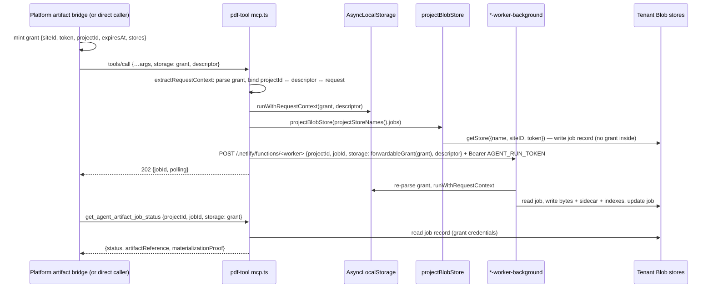

# Storage architecture and authority

> Source-verified at commit `60bdb98762e5c10849958dbd65beba73a0d1bb31`. The single Blob-store opener is `netlify/lib/artifact-core/blob-store.ts:projectBlobStore` (the only `@netlify/blobs` import in the repo); every claim below was traced through it.

## 1. Two Netlify sites, one credential switch

pdf-tool reads and writes **two different Netlify sites' Blob stores**, selected per call by what is in `AsyncLocalStorage`:

| Where the bytes live | Credential | Selected by | Used for |
|---|---|---|---|
| **The tenant's site** (the caller's) | the storage grant's `siteID` + `token` (`grantType: netlify-pat`) | `runWithRequestContext` puts the grant in ALS; `projectBlobStore` reads `currentStorageGrant()` (`artifact-core/blob-store.ts:100-103`) | artifacts, indexes, templates, render data, image-search bank/policies, **artifact/image-search job records**, generation ledger |
| **pdf-tool's own site** (`pdf-x`) | `PDF_TOOL_SITE_ID`/`PDF_TOOL_BLOBS_TOKEN` when set, else the Netlify same-site context (`artifact-core/blob-store.ts:144-150`, `storage-grant.ts:199-208`) | `jobBlobStore(...)` with no ALS grant, or the internal `pdf-tool-own-storage` grant minted by `runWithCaptureStorage` | MCP sessions, session grants, OAuth state, health probe, **all capture-plane data** |

Precedence inside `projectBlobStore`: an ALS grant **always wins** over caller-passed static credentials, which win over the same-site context. This is why `set_storage_grant` misroutes its own record (`KNOWN_ISSUES.md` KI-01): it runs with the tenant grant in ALS but is meant to write pdf-tool's own store.

The grant carries the **store names**: `projectStoreNames()` = canonical defaults ← `descriptor.storeNames` ← `grant.explicitStores` (`project-descriptor.ts:390-398`). Canonical names (`storage-grant.ts:45-52`): `artifacts`, `artifact-index`, `pdf-templates`, `image-search`, `pdf-render-data`, `pdf-tool-jobs`. Note the capture plane's own-storage grant sets `jobs` to `agent-artifact-jobs` instead (`capture/storage.ts:27-29`), and uses the canonical names `artifacts`/`artifact-index` **on pdf-tool's own site** — same names, different site, disjoint data.

## 2. Storage grant (`netlify/lib/storage-grant.ts`)

```json
{ "grantType": "netlify-pat", "projectId": "<tenant>", "siteId": "<netlify site id>", "token": "<blobs token>",
  "expiresAt": "<ISO>", "stores": { "artifacts": "...", "artifactIndex": "...", "templates": "...", "imageSearch": "...", "renderData": "...", "jobs": "..." },
  "limits": { "maxImageBytes": 5000000, "preferredImageFormat": "png" } }
```

| Rule | Implementation | Consequence |
|---|---|---|
| Implemented grant types | `SUPPORTED_GRANT_TYPES = ["netlify-pat"]` (`:61`); internal `pdf-tool-own-storage` is minted only server-side and is rejected from callers (`:74-77,122`) | a future `exchange` type plugs into `grantBlobCredentials` (`:199`) |
| Required fields | `siteId`/`siteID`/`site_id` and `token`/`blobsToken`/`blobs_token` (`:115-119`) | precise error names the missing field |
| `projectId` | **optional** (`:128`); when present it must equal the request's `projectId` and the descriptor's (`:242`, `project-descriptor.ts:345-354`, `validateProjectAccess`) | a grant without `projectId` binds to nothing — any `projectId` string is accepted with it |
| Expiry | rejected only when `expiresAt` parses and is in the past (`:164-170`) | no `expiresAt`, or an unparseable one, means **never expires** |
| Store names | explicit keys recorded in `explicitStores`; missing keys default to canonical (`:130-149`) | `forwardableGrant` re-serializes only explicit names so a worker sees the same precedence (`:182-185`) |
| Limits | `maxImageBytes` (positive int), `preferredImageFormat` (png/webp/jpeg) (`:151-162`) | inherited by image jobs that omit `requirements` |
| Persistence of the token | never in `ArtifactJobRecord` (zod strips unknown keys) or logs (`redactGrant`); **persisted** by `set_storage_grant` in `grants/{sessionId}.json` with TTL = min(session TTL, `expiresAt`) (`mcp-session-grant.ts:52-58`) | the session-grant store is the one place a tenant token rests at rest |
| Background jobs | forwarded in the worker POST body over https to the same site (`agent-artifact-worker-trigger.ts:69-78`); the worker re-parses it and binds ALS (`agent-artifact-worker-background.ts:55-60`) | a worker without a grant fails loudly (`STORAGE_GRANT_REQUIRED`), except the capture worker (`requireGrant:false`) |
| After expiry | every later call (status poll, resume, worker trigger) with that grant fails with `storage grant expired`; the job record is untouched | a pending job whose grant expired before the worker ran stays `pending` forever unless a caller re-triggers with a fresh grant (`KNOWN_ISSUES.md` KI-09) |

## 3. Authority table

| Domain | Canonical owner | Storage (site · store · key) | Writer | Reader | Mutation path |
|---|---|---|---|---|---|
| Artifact bytes | pdf-tool layout, tenant-owned data | tenant · `artifacts` · `{kind}/{safeRequestId}/{sha256}{ext}` | `artifact-layout.ts:saveArtifactBytes` (worker, url import, rasterize, capture) | verification (`readArtifactBytesSha256`), PDF edit source, inspect/rasterize, capture snapshot read | write-once, content-addressed; only delete: `update_image_search_candidate{deleteArtifact}` (`image-search/orchestrator.ts:314`) |
| Artifact sidecar | pdf-tool | tenant · `artifacts` · `{blobKey}.json` | `saveArtifactBytes` (`:127`) | nobody in shipped code | write-once |
| Request-scoped reference (authoritative "pdf-tool made this for request R") | pdf-tool | tenant · `artifact-index` · `request-artifacts/{encodeURIComponent(requestId)}/{sha256}.json` | `writeArtifactReferenceIndexes` | `verify_agent_artifact` `persisted` check; `artifactExistenceByKey` | write-once |
| Slot / filename pointers | pdf-tool | `by-slot/{projectId}/{requestId}/{slot}.json`, `latest-by-slot/…` (no reader), `by-filename/{projectId}/{requestId}/{filename}.json` (+ legacy keys without projectId, read-only) | same | `get_agent_artifact_by_slot/filename`, collision resolver | `by-slot` **overwritten** by the next artifact in the slot; `by-filename` gets `-2,-3…` suffixes instead |
| Tag pointers | pdf-tool | `by-tag/{tag}/{sha256}.json` | same | the `library` image-search provider lists `by-tag/{token}/` (eventually consistent `list()`) to reuse project media (`image-search/providers.ts:86`) | write-once |
| Kind / request pointers | pdf-tool | `by-kind/{kind}/{sha256}.json`, `by-request/{requestId}/{kind}/{sha256}.json` | same | **no shipped reader** (tests only) | write-once |
| Artifact job record | pdf-tool (record) inside tenant storage | tenant · `pdf-tool-jobs` · `projects/{projectId}/jobs/{jobId}.json` | `createArtifactJob` / `updateArtifactJob` (create, worker, status auto-fail, resume) | status/resume/worker | read-modify-write, no CAS |
| Generation ledger | pdf-tool | tenant · `pdf-tool-jobs` · `projects/{projectId}/budget/{requestId}.json` | `chargeGenerationBudget` | same | non-atomic read-modify-write (`generation-budget.ts:23-27`) |
| Image-search job | pdf-tool | tenant · `pdf-tool-jobs` · `projects/{projectId}/image-search-jobs/{jobId}.json` | `image-search/jobs.ts` | status tool, worker | read-modify-write |
| Candidate bank | tenant data | tenant · `image-search` · `banks/{requestId}.json` | orchestrator, url import | `get_image_search_bank` | in-place candidate mutation |
| Sourcing policy / image-model policy | tenant data | tenant · `image-search` · `policy.json`, `image-model-policy.json` | `set_image_search_policy`, `set_image_model_policy` | search, model routing | full overwrite |
| PDF templates | tenant data, pdf-tool versioning rules | tenant · `pdf-templates` · `pdfme/{templateId}/v{n}.json`, `meta.json`, `_index/{projectId}.json`, `validation/v{n}.json`, `previews/v{n}.json`, plus `thumbnails/{templateId}/v{n}.png` and `previews/{templateId}/v{n}-p{page}.png` (outside the `pdfme/` prefix) | template tools + workers | template tools, job route resolution | version record: `templateJson` never rewritten; `status`, `thumbnailKey`, `lastValidation` are patched in place after publish |
| Render data (for PDF edits) | pdf-tool | tenant · `pdf-render-data` · `render-data/{jobId}.json` | worker after a template render | `executePdfEditJob` via `baseDataRef` | write-once |
| MCP session | pdf-tool | own · `mcp-sessions` · `sessions/{uuid}.json` | `initialize`, touch on every request | `checkSession` | TTL `MCP_SESSION_TTL_SECONDS` (86400), deleted on `DELETE` |
| Session grant | pdf-tool (holds a tenant secret) | own · `mcp-session-grants` · `grants/{sessionId}.json` (**actually written to the tenant site today — KI-01**) | `set_storage_grant` | `callTool` fallback | TTL-capped; cleared on session `DELETE` |
| OAuth | pdf-tool | own · `mcp-oauth` · `clients/{id}.json` (never read), `used-codes/{jti}.json` (never expired) | register, token | token (single-use check) | append-only |
| Health probe | pdf-tool | own · `agent-artifact-jobs` · `health/probe.json` | `/health`, MCP `health` | same | write/read/delete each call |
| Capture job (+ frontier) | pdf-tool | own · `agent-artifact-jobs` · `projects/{projectId}/capture-jobs/{jobId}.json`, `…/by-request/{requestId}.json` | capture tools + worker | capture tools + worker | frontier rewritten after every page |
| Capture output (snapshot, screenshots, assets) | pdf-tool (tenant has no direct access) | own · `artifacts` / `artifact-index` under the canonical layout, kind `binary`, tag `capture` | capture worker via `saveArtifactBytes` | `get_capture_snapshot` (snapshot JSON only, ≤ inline ceiling) | write-once; **screenshot/asset bytes have no export path** (`CAPTURE_ARCHITECTURE.md §6`) |
| Workflow JSON, content items, publish state | **Platform / CMS-Agent** | not in pdf-tool | never pdf-tool | never pdf-tool | `workflowPatchStatus: "skipped_by_design"` on every job response |

## 4. Storage-grant data flow



What the grant is **not**: it is not an identity (nothing checks that the site behind `siteId` belongs to `projectId`), it is not revocable by pdf-tool (Netlify PAT lifecycle is the tenant's), and it is not validated against Netlify at parse time (an invalid token surfaces as a 401 from `@netlify/blobs` on first use, mapped to "job store unavailable" / a tool error).

## 5. Consistency notes

- Blobs `get`/`set` with `consistency: "strong"` are strongly consistent; **`list()` is eventually consistent regardless** (`artifact-index.ts:172-190`). The only request-path lister is the `library` image-search provider (`by-tag/` prefix), which is why a just-imported image can be missing from the next search's library results; template listing reads `_index/{projectId}.json` (a maintained record, not a listing).
- Job records use blind read-modify-write. Two concurrent writers (worker vs. status auto-fail; resume vs. worker) can interleave; the last write wins and can drop fields (`KNOWN_ISSUES.md` KI-06).
- `saveArtifactBytes` writes bytes, sidecar, then seven-ish index keys in parallel (`artifact-index.ts:82-97`). A crash between the bytes write and the job-record update leaves a fully indexed artifact with a job that later auto-fails (`KI-07`).
- Two functions named `safePathSegment` exist with different semantics: `artifact-layout.ts:30` (regex sanitizer, lossy — used in blob keys and job keys) and `artifact-index.ts:15` (`encodeURIComponent`, near-injective — used in index keys). `requestId` therefore appears in two encodings; `verify_agent_artifact` documents that the blob-key form is only a pre-filter.
